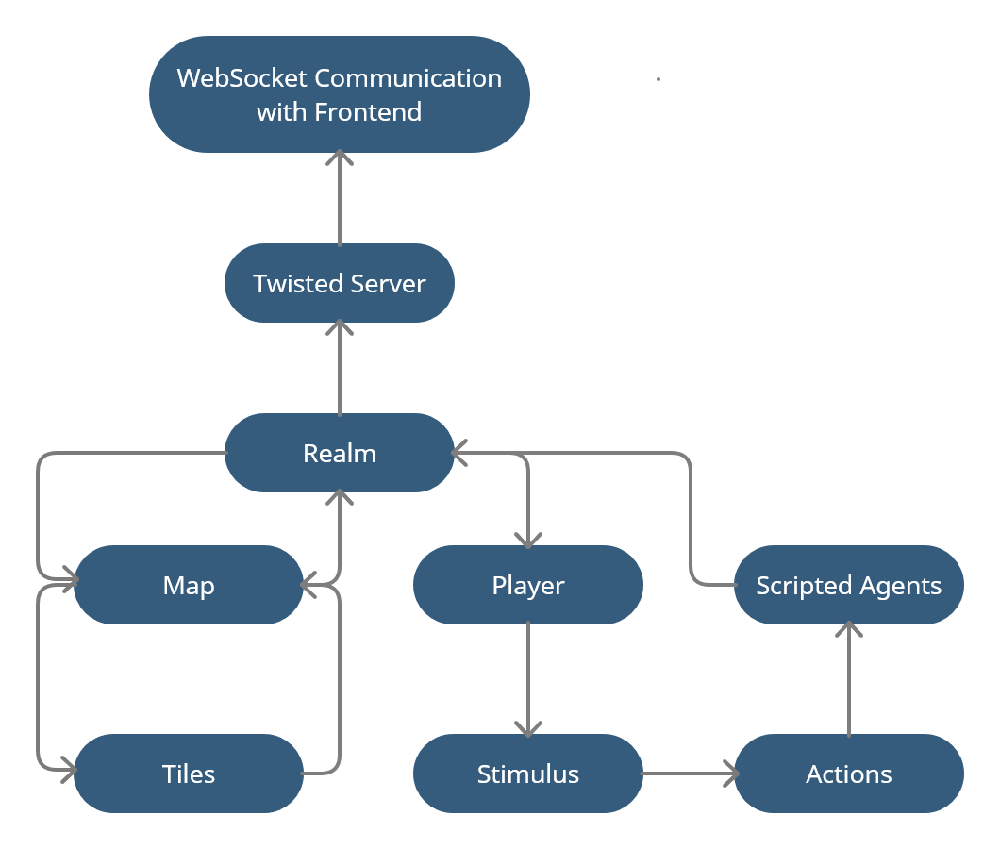

# Tech documentation

## Backend

Our backend architecture is as shown above, working backwards from the packet that gets sent to the frontend by the Twisted server. The Realm class contains all of the information about the simulation at any given time, and packets this information, and sends it to the server. It also sends updates to the map, such as when trees are harvested or items are picked up off the ground. This information is sent from the map to the individual tiles, then back to the Realm on the next timestep.

Additionally, the Realm sends information to Players, or agents, in the simulation. This causes them to update their Stimulus, which includes food, water, inventory, light communication, and so on. The scripted agents that are running view this Stimulus, and generate Actions as a result, which are sent back to the Realm. The Realm decides the result of these actions, and sends that to both the Twisted server, and back to the map and players.

## Frontend 

Our frontend is built on the Unity client from NeuralMMO, which renders a 3D simulation of agents and the interactions with map from NeuralMMO backend through packet communication. Center in the frontend codebase is the client console that serves as the main controller in regulating the behaviors of communication, UI, environment and player manager components. As shown in the below graph that illustrates the code structure in frontend, our new changes and implementations to the codebase are marked with yellow: there include two main modifications which are environment and character (defined behaviors of players and NPCs).     

### Environment.cs 
To accomodate the new design of features, such as resource items and factories, we had to re-implement the original implementation of frontend. As it organized the rendering of tilemap based on chunk of tiles, it could not be easily modified to support storing different resoucres items on individual tiles, which is now a new feature. As a result, we designed a new hierarchized system as the environment manager. As shown in the above graph, the new implementation is hiearchally organized to have separate layers for 

1. lower layer: items and factories which are objects located on the tiles (e.g. sticks and trees) 

2. middle layer: tiles (with different variaties, and for better distinguishment, the color depends based on the resource factory on the top) updates its content of items and status of factories

3. upper layer: environment manager that organizes and updates an array of tiles

The benefits of such hiearchical organization is that each layer is encapsualted well and was proven to be flexible to changes (e.g. we later changed the generation of all tile materials with very minimal lines of new code).
In addition, to optimize the performance of the environment rendering, we improved the existing resoucre loading system. It was to load from memory every creation and update of a new tile chunk. With our changes, there is no repetitive loading of same resoucre regardless of the times it is used in rendering environment.

### Character.cs

In addition to the major changes in environment, we also added new features, namely light-based communication and tool usage, in Character.cs which is the class that defines the behaviors of player and NPC. Both two features are both structurally and functionally well encapsulated, which help the process of debugging and the future introduction of new features.
