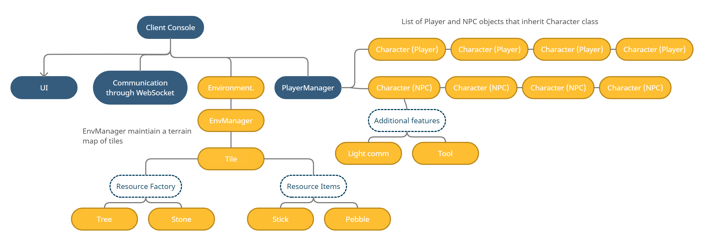

# Tech documentation

## Backend

## Frontend 

Our frontend is built on the Unity client from NeuralMMO, which renders a 3D simulation of agents and the interactions with map from NeuralMMO backend. Center in the frontend codebase is the client console that serves as the main controller in regulating the behaviors of communication, UI, environment and player manager components. As shown in the below graph that illustrates the code structure in frontend, one could our new changes and implementations to the codebase marked with yellow: there include two main modifications which are environment and character (defined behaviors of players and NPCs).     

### Environment 

### Character
